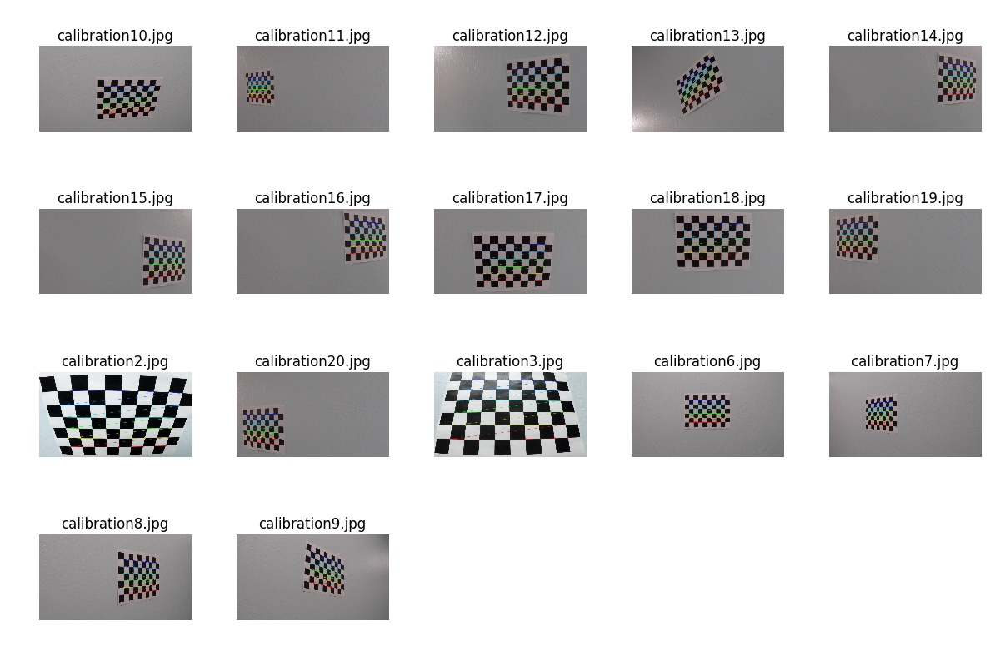

# Advanced Lane Finding Project - Writeup

The goals / steps of this project are the following:

* Compute the camera calibration matrix and distortion coefficients given a set of chessboard images.
* Apply a distortion correction to raw images.
* Use color transforms, gradients, etc., to create a thresholded binary image.
* Apply a perspective transform to rectify binary image ("birds-eye view").
* Detect lane pixels and fit to find the lane boundary.
* Determine the curvature of the lane and vehicle position with respect to center.
* Warp the detected lane boundaries back onto the original image.
* Output visual display of the lane boundaries and numerical estimation of lane curvature and vehicle position.

## Camera Calibration

***Briefly state how you computed the camera matrix and distortion coefficients. Provide an example of a distortion corrected calibration image.***

In this project, the camera calibration is performed by using the Chessboard Corners method. In particular, 20 pictures of a chessboard were taken from different perspective angles, consequently, the OpenCV  `cv2.findChessboardCorners()` function was used to identify the chessboard corners in the calibration images.

The figure below depicts the calibration images annotated with the chessboard corners identified.



Once the chessboard corners are identified, we can **calibrate** our camera by using the `cv2.calibrateCamera()` function which takes as input two sets of points: the former contains 3d points in real world space whereas, the latter contains 2d points in the image plane.

The `cv2.calibrateCamera()` function returns two interesting pieces of information:

  * A transformation matrix.
  * A vector of distances between the points in the 3d space and the points in the 2d image space.

Using these two pieces of information we can correct the camera distortions generated by the camera lens.

The image below depicts a distorted chessboard that has been corrected using the `cv2.undistort()` function.


## Pipeline (test images)

***Provide an example of a distortion-corrected image.***

Once I was able to prove the correctness of the undistortion procedure, I decided to save into a `pickle` file the **calibration matrix** of the camera as well as the **vector of distances**. By doing so, I can avoid to re-calibrate the camera for the pipeline.

The picture below provide a visual example of how the undistortion procedure will correct the input images of the pipeline.


***Describe how (and identify where in your code) you used color transforms, gradients or other methods to create a thresholded binary image. Provide an example of a binary image result.***

To correctly detect the lane lines I am going to leverage the following Computer Vision techniques to create a binary image:

  * Color space mapping - RGB to HLS.
  * Color thresholding - (170, 255).
  * Sobel gradients - (kernel size: 9).
  * Gradients thresholding - (20, 100).

The *Create a Binary Image* cell in the `pipeline.ipynb` notebook implements the code to generate a binary image.

The snipped below reports the key points of the procedure.

```python
	# Convert to HSV color space and separate the S channel
    hsv = cv2.cvtColor(img, cv2.COLOR_RGB2HLS).astype(np.float)
    h_channel = hsv[:,:,0]
    l_channel = hsv[:,:,1]
    s_channel = hsv[:,:,2]

    # Use the s_channel
    channel = s_channel
    
    # Sobel x and y
    sobel_x = cv2.Sobel(channel, cv2.CV_64F, 1, 0, ksize=sobel_kernel)
    sobel_y = cv2.Sobel(channel, cv2.CV_64F, 0, 1, ksize=sobel_kernel)

    # Absolute derivative in x and y
    sobel_x_abs = np.absolute(sobel_x)
    sobel_y_abs = np.absolute(sobel_y)

    # Scale to 8-bit (0 - 255) then convert to type = np.uint8
    scaled_sobel_x = np.uint8(255*sobel_x_abs/np.max(sobel_x_abs))

    # Threshold x gradient
    sx_binary = np.zeros_like(scaled_sobel_x)
    sx_binary[(scaled_sobel_x >= sx_thresh[0]) & (scaled_sobel_x <= sx_thresh[1])] = 1
    
    # Threshold color channel
    s_binary = np.zeros_like(s_channel)
    s_binary[(channel >= sc_thresh[0]) & (channel <= sc_thresh[1])] = 1

    # Create a binary flat image.
    flat_binary = np.zeros_like(sx_binary)
    flat_binary[(sx_binary == 1) | (s_binary == 1)] = 1

    return flat_binary
```

The result of the procedure is depicted below.


As can we see from the snippet, firstly, the image color space was mapped from RGB to HLS and the S channel was chosen for the purpose of this project. This specific channel is independent from the lane lines color and allow us to correctly indentify either yellow and white lines.

***Describe how (and identify where in your code) you performed a perspective transform and provide an example of a transformed image.***

The next step of the pipeline consists in performing a perspective transformation from the real world image space to the *bird's eye* space. The bird's eye space is really handy in this particular application because it allows us to treat the binary image pixels as dots and fit them with a particular 2nd order polynomial.

Therefore, I have first choosen 4 points in the original image (two points at the bottom of the image lane lines, two at the top of the lane lines) and map them to a square in the bird's eye space. Secondly, I leveraged on the `cv2.warpPerspective()` function to transform the original image and generate the bird's eye perspective.

The cell **Apply Perspective Transformation (Bird's eye)** in the `pipeline.ipynb` notebook implements the bird's eye transformation. 
The figure below depicts the output of the bird's eye transformation.


***Describe how (and identify where in your code) you identified lane-line pixels and fit their positions with a polynomial?***

Starting from the warped image, we can consider the image pixels as they are the result of a scatter plot. By leveraging this fact, we can slice the image in a set of windows (typical 9 or 10) that reduce the noise of the image pixels.

However, before moving any further we need to find the starting point of the lane lines (at the bottom of the image). In this particular scenario we can compute a particular histogram of the image. This histogram will sum up the pixel values in the image and will help us in identify the starting point of the lines.

The figure below depicts the histogram computed on the lower half of the warped image depicted above.


As can we see, the histogram identified a line starting at pixels range (200, 300) and one at pixels range (1000, 1100).

By identifying the starting point of the lines we can use the sliding windows technique to reduce the noise of the lane lines.

The figure below depicts the sliding windows technique.


Once the lane lines are identified with two sets of (x,y) pairs, we can fit them using a 2nd order polynomial in the form `f(y) = A*y^2 + B*y + C`. This mathematical form will allow us to better identify the curve radius.

***Describe how (and identify where in your code) you calculated the radius of curvature of the lane and the position of the vehicle with respect to center.***

In order to calculate the radius of the curve we use a simple but powerful technique that computes analitically the radius of a circle that is tangent to a function in a given point.
The method relies on the first and second order derivative of the function and defines the curve radius as follows:

`R = (1/|2A|) * (1 + (2Ay + B)^2)^3/2`

In addition, I calculate an estimation of the car position on the lane. The technique is pretty simple. Firstly, I determined the lane center by calculating the difference between the position of the right and the left lines. Secondly, I determined the center of the car which is the mid point of the image (because the camera in mounted on the car). The position of the car on the lane is given by the difference between the center of the lane and the center of the car.

Finally, it is worth noting that, all these calculations are made in a *pixel space*. Therefore, to give a meaning to the values we need to transform them to the real world space. Lukily for us, we can use the following constants:

  * `ym_per_pix = 30/720 # meters per pixel in y dimension`
  * `xm_per_pix = 3.7/700 # meters per pixel in x dimension`

which maps the number of meters per pixel in the x and y dimensions.

***Provide an example image of your result plotted back down onto the road such that the lane area is identified clearly.***

The last step consists in plotting back to the original image space the lane identified in the bird's eye space. In this phase we can rely on the `cv2.warpPerspective()` function which takes as input the image to transform and the **inverse** of the transformation matrix computed in the camela calibration process.

The result of the pipeline on a single image is depicted below.


## Pipeline (video)

***Provide a link to your final video output. Your pipeline should perform reasonably well on the entire project video (wobbly lines are ok but no catastrophic failures that would cause the car to drive off the road!)***

A demonstration of the pipeline can be found on the `output_video` directory.

## Discussion

***Briefly discuss any problems / issues you faced in your implementation of this project. Where will your pipeline likely fail? What could you do to make it more robust?***

The pipeline I wrote is working pretty well in the first video. However, it may fail to detect lane lines in case the camera images are too bright. A reasonable solution would be to apply the image **histogram normalization**. This technique will enhance the image contrast and, as a consequence, the S channel of the HLS transformation would better detect the lines.

A second enhancement on the project would be to implement a 5th order filter on the lane lines (i.e. keeping track of the last 5 lines found and average the new lines on the 5 already discovered).

The most triky part of the entire project, however, I think is implementing the logic to detect the lines using the sliding windows techniques.

*Stefano*